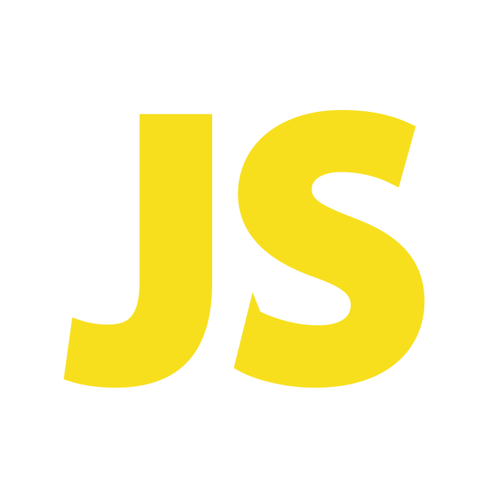

<h1 align="center">
  Hi there, I'm Raushan
</h1>

  A web developer with experience in JavaScript and Python. I have a passion for creating beautiful, responsive, and user-friendly web applications. I'm always striving to stay up-to-date with the latest technologies, and I'm excited to learn new skills and tackle new challenges.

<h2 align="left">
  Languages & Tools
</h2>

  
  
  
  
  
  
  
  

